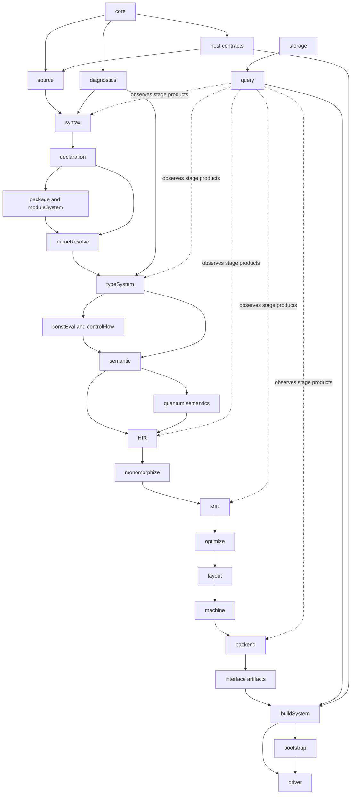
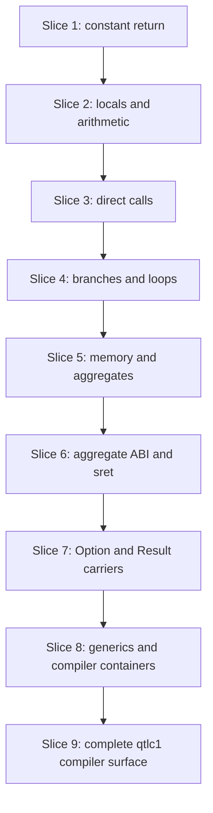

# qtlc1 Independent Native Self-Hosting Roadmap

Status: authoritative implementation roadmap

Scope: replace qtlc1's qtlc0 backend delegation with a complete qtlc1-owned
HIR, MIR, machine IR, native lowering, ELF object, link, and bootstrap proof
pipeline.

This page is the execution authority for the architecture prerequisite and the
eight native self-hosting phases below.
The older implementation, cache, backend, and bootstrap pages remain useful
design references, but a status claim conflicts with this page when it treats
metadata-only products, counters, or qtlc0 delegation as completed native
self-hosting.

## Current Truth

The current stage flow is:

```text
qtlc0 builds qtlc1
qtlc1 checks qtlang/compiler with its frontend
qtlc1 asks CompilerIo.buildNativeCompiler(...)
compiler_host_abi.cpp starts qtlc0
qtlc0 emits and links qtlc2
```

Therefore:

```text
qtlc1 orchestrates the qtlc2 build
qtlc0 still owns qtlc2 native lowering, object emission, and linking
qtlc2 is not yet proof of an independent qtlc1 backend
```

Several current backend types are useful contracts, but they are not executable
compiler products yet. Counts such as instruction count, object count, or
terminator count cannot establish that valid code bytes exist.

## Required End State

The completed stage flow must be:

```text
qtlc0 --native--> qtlc1
qtlc1 --native--> qtlc2
qtlc2 --native--> qtlc3
```

The final qtlc1 build path must not start qtlc0 for frontend, lowering, object,
archive, or link work. qtlc0 remains only:

```text
the seed compiler that produces qtlc1
a differential reference while implementation is in progress
an explicit emergency developer tool, never an accepted release proof
```

## Non-Negotiable Engineering Rules

1. Do not weaken qtlc1 validation to accommodate qtlc0.
2. Fix a required qtlc0 ABI or lowering defect in qtlc0 instead of encoding a
   permanent qtlc1 workaround.
3. No readiness property may be derived only from counts or non-empty names.
4. A product is materializable only after structural verification succeeds.
5. Unsupported language rows fail with a stable diagnostic before artifact
   publication.
6. Generated C, generated C++, simulated objects, and metadata-only objects are
   not native backend support.
7. Stable IDs, iteration order, symbol order, section order, and hashes must be
   deterministic.
8. Every executable product owns a source map back to the originating typed
   source.
9. Every cache key includes compiler identity, target, ABI, profile, relevant
   feature set, input product hashes, and format version.
10. Publication uses a temporary file, validation, flush/close, and atomic
    rename.
11. Host processes are started with typed argv. Shell command strings are not
    part of the compiler architecture.
12. Per-body and per-object-unit work is the default. Whole-package work is
    allowed only where the artifact format requires it.
13. Linux x86-64 SysV ABI and ELF64 are the first complete target. Other target
    files must report unsupported until they have equivalent proof.
14. Hot-path lookup uses direct stable-ID/indexed structures. Large generic
    carriers such as `Option<T>` still receive complete language and ABI
    support; hot-path specialization must not leave the generic feature
    incomplete.
15. Large implementation files are split by semantic ownership, not by an
    arbitrary line count.

## Architecture Audit

The repository currently has 22 active production modules:

```text
backend       bootstrap      buildSystem    controlFlow
core          diagnostics    driver         frontend
hir           interface      machine        mir
moduleSystem  nameResolve    optimize       platform
quantum       query          semantic       source
syntax        typeSystem
```

Four additional intended boundaries exist only as placeholder directories:

```text
constEval
layout
monomorphize
package
```

The existing structure is usable as a bootstrap scaffold, but several modules
combine unrelated ownership:

```text
frontend
  declaration storage
  lexer/parser coordination
  whole-frontend products

platform
  target operating-system policy
  embedded device policy
  compiler host I/O
  progress reporting
  output transactions

buildSystem
  build orchestration
  cache object formats and content identities
  self-host orchestration

quantum
  semantic types/effects/resources
  control-flow models
  HIR/MIR lowering
  target IR and backend-facing models

controlFlow
  syntax/semantic control-flow facts
  HIR/MIR-facing lowering facts
```

These mixed responsibilities create incorrect dependency pressure:

```text
moduleSystem -> frontend
nameResolve  -> frontend
typeSystem   -> frontend
typeSystem   -> semantic
source       -> platform
syntax       -> platform
query        -> buildSystem
controlFlow  -> hir/mir by declared module policy
```

The roadmap must correct these boundaries before executable HIR grows around
them.

## Core Boundary

`core` is the compiler-owned data foundation. It is not the root package of the
compiler pipeline and must not become a generic location for unrelated shared
types.

`core` owns:

```text
Arena, Vec, Slice, Array
Map, Index, Interner
basic compiler ID value types
Range and row containers
bytes, cursors, codecs, and checked buffers
stable hash primitives
small communication primitives
basic text contracts
```

`core` must not own:

```text
source files or source maps
diagnostics
declarations or symbols
query products or cache policy
HIR/MIR/machine products
target ABI or object formats
filesystem, process, terminal, or environment access
build or bootstrap policy
```

No `irCommon` module will be created. IDs, bytes, hashes, source maps, query
metadata, and representation verifiers remain with their actual owners.

## Target Module Architecture

The target architecture has 29 top-level ownership boundaries. Existing
modules are retained where their ownership is sound; new boundaries are created
only to remove a demonstrated dependency inversion.

```text
Foundation
  core

Compiler host boundary
  host

Source and diagnostics
  source
  diagnostics

Syntax
  syntax

Declarations and package graph
  declaration
  package
  moduleSystem

Semantic analysis
  nameResolve
  typeSystem
  constEval
  controlFlow
  semantic

Language semantics
  quantum

Intermediate representations
  hir
  monomorphize
  mir
  optimize

Target and layout
  layout
  machine
  platform

Artifact production
  backend
  interface

Incremental infrastructure
  storage
  query

Orchestration
  frontend
  buildSystem
  bootstrap
  driver
```

This is a dependency DAG, not a directory parent tree. `core`, `source`, HIR,
MIR, and query are peers with different responsibilities and dependency levels.



The executable compilation path is:

```text
host/source
  -> syntax
  -> declaration/package/moduleSystem
  -> nameResolve/typeSystem/constEval/semantic
  -> HIR
  -> monomorphize
  -> MIR/optimize
  -> layout/machine
  -> backend
  -> interface/buildSystem
  -> driver/bootstrap
```

`frontend` is an orchestration facade over the frontend stages. Declaration,
module, name-resolution, and type-system data modules must not import it.

## Corrected Ownership

### Declaration

Move declaration-owned pages out of `frontend`:

```text
qtlang/compiler/declaration/
  declarationKind.qn
  declarationVisibility.qn
  declarationKey.qn
  declarationRecord.qn
  declarationRecordRange.qn
  declarationParserRows.qn
  declarationParserRecordSamples.qn
  declarationRecordRows.qn
  declarationRecordSource.qn
  declarationRecordBatch.qn
  declarationArena.qn
  declarationIndex.qn
  declarationSet.qn
  declarationTable.qn
  declarationRecordTable.qn
  stableDeclarationHash.qn
```

Parser bridge and pipeline pages remain in `frontend`. After migration:

```text
moduleSystem -> declaration
nameResolve  -> declaration + moduleSystem
typeSystem   -> declaration + moduleSystem + nameResolve
frontend     -> syntax + declaration + moduleSystem + typeSystem
```

### Host And Platform

Create a compiler-host boundary:

```text
qtlang/compiler/host/
  fileSystem.qn
  process.qn
  environment.qn
  compilerIo.qn
  compilerProgress.qn
  outputTransaction.qn
  linkerTool.qn
  clock.qn
```

`host` defines typed capabilities and the bootstrap implementation bridge.
`source`, syntax, and semantic stages consume narrow host capabilities rather
than importing target-platform policy.

`platform` retains:

```text
operating-system model
embedded board/device model
runtime environment policy
platform-specific target defaults
```

`machine` retains:

```text
target triple
data layout
calling convention
register and instruction descriptions
object-format selection
```

### Storage, Query, And Build

Create storage below query:

```text
qtlang/compiler/storage/
  contentAddress.qn
  cacheHash.qn
  cacheObjectFormat.qn
  cacheValidation.qn
  cacheAtomicWrite.qn
  cacheLease.qn
  cacheQuarantine.qn
  schemaMigration.qn
  artifactStore.qn
```

Move generic cache bytes, identities, validation, and atomic publication from
`buildSystem` to `storage`.

Ownership becomes:

```text
storage
  durable content-addressed bytes and safety

query
  query keys, fingerprints, dependency graph, QDB, product lookup/replay

buildSystem
  build graph, scheduling, artifact policy, linking workflow, self-host stages
```

Required dependency:

```text
storage <- query <- buildSystem
```

`query` products contain keys, hashes, dependency identity, validation state,
and references to stage-owned payloads. Query must not define HIR, MIR, machine
IR, object, or linked-executable representation internals.

### Semantic Completion Boundaries

Activate the existing placeholder directories:

```text
package
  package identity, manifest result, package graph, target declarations

constEval
  typed constant evaluation and deterministic constant products

monomorphize
  generic instance discovery, substitution, ownership, and body worklist

layout
  language type layout, aggregate layout, tagged carrier layout,
  ABI-facing layout queries
```

`typeSystem` determines types; `layout` determines their target representation.
Primitive catalog facts may describe language-level properties, but complete
target size/classification policy must not remain distributed inside the type
catalog and backend.

`semantic` owns the immutable checked-program result assembled from module,
resolution, type, constant, effect, ownership, and semantic control-flow
products. Therefore:

```text
semantic may import typeSystem
typeSystem must not import semantic
```

Type checking returns type-owned products. A higher semantic assembler creates
`SemanticModel`, `CheckedFile`, `CheckedModule`, and `PublicApi`.

### Control-Flow Ownership

Keep representation-neutral semantic analysis under `controlFlow`:

```text
reachability
definite return
loop target legality
break/continue result rules
parallel semantic contracts
AST-to-semantic control-flow classification
```

Move representation-specific facts:

```text
hir/controlFlow
  structured HIR control regions and semantic-to-HIR mapping

mir/controlFlow
  CFG blocks, edges, predecessors, dominators, and MIR verification
```

The top-level `controlFlow` module must not import HIR or MIR after Phase 0.

### Quantum Ownership

Keep language semantics under `quantum`:

```text
types
effects
resource ownership and lifetime
quantum operations
semantic control-flow rules
semantic verification
```

Move representation-specific work to the representation owner:

```text
hir/quantum
  quantum HIR rows and semantic-to-HIR lowering

mir/quantum
  quantum MIR rows and HIR-to-MIR lowering

backend/quantum
  QTIR/QMIR emission, target mapping, scheduling, artifact production
```

This prevents the semantic `quantum` module from importing down into multiple
IR and backend levels.

## Allowed Import Matrix

Each row lists its permitted production dependencies. Self-imports and imports
of a module's internal submodules are omitted.

| Module/layer | Permitted dependencies |
|---|---|
| core | none |
| host | core |
| source | core, host |
| diagnostics | core, source |
| syntax | core, host capabilities, source, diagnostics |
| declaration | core, source, diagnostics, syntax |
| package | core, host capabilities, source, diagnostics |
| moduleSystem | core, source, diagnostics, syntax, declaration, package |
| nameResolve | core, source, diagnostics, declaration, package, moduleSystem |
| typeSystem | core, source, diagnostics, syntax, declaration, package, moduleSystem, nameResolve |
| constEval | core, source, diagnostics, declaration, typeSystem contracts |
| controlFlow | core, source, diagnostics, syntax, declaration, typeSystem contracts |
| semantic | core, source, diagnostics, declaration, package, moduleSystem, nameResolve, typeSystem, constEval, controlFlow |
| quantum semantics | core, source, diagnostics, syntax contracts, typeSystem, semantic |
| HIR | core, source, diagnostics, declaration, typeSystem products, semantic, quantum semantics |
| monomorphize | core, diagnostics, declaration, typeSystem products, semantic, HIR |
| MIR | core, source, diagnostics, typeSystem products, semantic, HIR, monomorphize |
| optimize | core, diagnostics, MIR |
| layout | core, diagnostics, typeSystem products, semantic, monomorphize, machine target facts |
| machine | core |
| platform | core, machine target identities |
| storage | core, host capabilities |
| query | core, host clock/filesystem capabilities, source identities, storage |
| backend | core, host process/filesystem capabilities, diagnostics, semantic products, MIR, optimize, layout, machine, storage/query product interfaces |
| interface | core, host filesystem capabilities, diagnostics, declaration, package, semantic products, layout, storage |
| frontend | host capabilities, source, diagnostics, syntax, declaration, package, moduleSystem, nameResolve, typeSystem, constEval, controlFlow, semantic, query |
| buildSystem | core, host capabilities, package, machine, platform, storage, query, backend, interface |
| bootstrap | core, host capabilities, storage, query, buildSystem |
| driver | all public compiler-stage facades; driver is a leaf |

Special rules:

```text
frontend is orchestration only; lower data modules never import it
driver and bootstrap are leaves; no compiler stage imports them
host exposes capabilities, never compiler-stage policy
query observes products through keys/adapters, not representation ownership
backend never imports frontend, driver, or buildSystem
HIR never imports MIR, machine, backend, query, buildSystem, or driver
MIR never imports machine, backend, query, buildSystem, or driver
typeSystem never imports semantic or frontend
controlFlow semantic analysis never imports HIR or MIR
storage never imports query or buildSystem
query never imports buildSystem
```

## Product Contract

Every major stage returns a real immutable product:

```text
StageProduct
  identity
    stable product ID
    owner module/body/unit ID
    target and ABI where relevant
    format version
  content
    owned rows or immutable byte storage
    deterministic content hash
  dependencies
    direct input product IDs and hashes
  evidence
    verifier report
    source map
    diagnostics
  state
    valid
    deterministic
    cacheable
    materializable
```

`materializable` is an implementation view derived from complete evidence:

```qn
impl view NativeObjectProduct {
  pub materializable: bool => {
    identity.valid &&
    bytes.valid &&
    bytes.count > 0 &&
    sections.valid &&
    symbols.valid &&
    relocations.valid &&
    verification.valid &&
    verification.elfAccepted &&
    deterministic
  }
}
```

Do not create setters such as `markReady()` for derived product states.

## Module Budget

The native implementation inventory after removing the incorrect `irCommon`
proposal is:

| Area | Production | Proof/test | Total |
|---|---:|---:|---:|
| Phase 1: executable HIR | 18 | 4 | 22 |
| Phase 2: executable MIR | 22 | 5 | 27 |
| Phase 3: machine IR | 16 | 3 | 19 |
| Phase 4: native lowering | 24 | 5 | 29 |
| Phase 5: ELF object writer | 14 | 4 | 18 |
| Phase 6: real link stage | 12 | 3 | 15 |
| Phase 7: self-host integration | 8 | 4 | 12 |
| **Native scope total** | **114** | **28** | **142** |

Production counts cover implementation pages and exclude `mod.qn` aggregators
and `module.toml` manifests. Proof counts cover executable test pages and
exclude fixture source data.

The architecture migration is tracked separately because most of its work is
moving or splitting existing pages rather than adding modules:

| Architecture boundary | Planned implementation pages | Change type |
|---|---:|---|
| declaration | 16 | moved from frontend; runtime scan conversion remains in the frontend bridge |
| host | 9 | move/split platform host services, including a private intrinsic boundary |
| storage | 9 | move/split build-system cache primitives |
| package | 6 initial | activate placeholder boundary |
| constEval | 8 initial | activate placeholder boundary |
| monomorphize | 10 initial | activate placeholder boundary |
| layout | 12 initial | activate placeholder boundary |
| quantum ownership relocation | existing pages | move by representation owner |
| control-flow ownership relocation | existing pages | move by representation owner |
| **Architecture pages affected** | **66 plus quantum/control-flow moves** | mostly non-additive |

The final whole-compiler file count must be frozen after
`POST-QTLC1-ARCHITECTURE-048`, when every page has a move/create/merge decision.
Adding `66` to `142` would be incorrect because moved pages already exist and
some HIR/MIR/layout pages overlap the native inventory.

Stable count claims:

```text
29 target top-level ownership boundaries
114 production pages in the native self-host implementation inventory
28 focused native/bootstrap proof pages
142 native-roadmap pages total
66 architecture pages affected before quantum/control-flow relocation is counted
```

This does not mean 142 new files. Existing HIR, MIR, native backend, link, and
self-host skeletons count toward the target.

## Target Directory And Page Plan

Only true import boundaries receive `module.toml` and `mod.qn`. Organization
folders stay internal unless independent imports or ownership justify a real
submodule.

Markers:

```text
[E] expand an existing logical module
[N] create a new logical module
[R] replace or rename an existing placeholder under an owned command
```

### Architecture Migration Boundaries

No `irCommon` directory is permitted. The Phase 0 target tree is:

```text
qtlang/compiler/
  core/                          [E, foundation only]
  host/                          [N from platform host services]
  source/                        [E]
  diagnostics/                   [E]
  syntax/                        [E]
  declaration/                   [N from frontend declaration pages]
  package/                       [activate existing placeholder]
  moduleSystem/                  [E]
  nameResolve/                   [E]
  typeSystem/                    [E]
  constEval/                     [activate existing placeholder]
  controlFlow/                   [E]
  semantic/                      [E]
  quantum/                       [E, semantics only]
  hir/                           [E, includes hir/quantum]
  monomorphize/                  [activate existing placeholder]
  mir/                           [E, includes mir/quantum]
  optimize/                      [E]
  layout/                        [activate existing placeholder]
  machine/                       [E]
  platform/                      [E, platform policy only]
  backend/                       [E]
  interface/                     [E]
  storage/                       [N from build-system cache pages]
  query/                         [E]
  frontend/                      [E, orchestration only]
  buildSystem/                   [E]
  bootstrap/                     [E]
  driver/                        [E]
```

Compatibility re-exports may exist for one migration command, but new code must
import the final owner immediately. Compatibility aliases must carry a removal
command and cannot survive the Phase 0 exit gate.

### Phase 1, HIR: 18

```text
qtlang/compiler/hir/
  mod.qn                         [E]
  hirProduct.qn                  [N]
  hirBody.qn                     [N]
  hirModule.qn                   [E]
  hirItem.qn                     [E]
  hirFunction.qn                 [E]
  hirParameter.qn                [N]
  hirLocal.qn                    [N]
  hirBlock.qn                    [E]
  hirStmt.qn                     [E]
  hirExpr.qn                     [E]
  hirPattern.qn                  [N]
  hirTypeRef.qn                  [E]
  hirConstant.qn                 [N]
  hirCall.qn                     [N]
  hirSourceMap.qn                [N]
  hirVerifier.qn                 [N]
  typedAstLowering.qn            [E]
  stableHirHash.qn               [E]
```

The current fact-only pages remain only when they represent useful diagnostics.
Synthetic counts move out of the executable product path.

### Phase 2, MIR: 22

```text
qtlang/compiler/mir/
  mod.qn                         [E]
  mirProduct.qn                  [N]
  mirBody.qn                     [E]
  mirFunction.qn                 [E]
  mirLocal.qn                    [N]
  mirBlock.qn                    [E]
  mirValue.qn                    [E]
  mirPlace.qn                    [N]
  mirOperand.qn                  [N]
  mirConstant.qn                 [N]
  mirInstruction.qn              [E]
  mirTerminator.qn               [E]
  mirCall.qn                     [N]
  mirAggregate.qn                [N]
  mirDrop.qn                     [N]
  mirSourceMap.qn                [N]
  mirCfg.qn                      [R]
  mirBuilder.qn                  [E]
  hirMirLowering.qn              [R]
  mirVerifier.qn                 [N]
  stableMirHash.qn               [E]
  mirPrinter.qn                  [N]
  mirCodec.qn                    [N]
```

MIR is explicit control flow. It owns blocks, values, places, calls, drops, and
terminators. It does not contain physical registers, ELF symbols, or linker
policy.

### Phase 3, Machine IR: 16

```text
qtlang/compiler/backend/native/machineIr/
  mod.qn                         [N]
  machineProduct.qn              [N]
  machineFunction.qn             [N]
  machineBlock.qn                [N]
  machineInstruction.qn          [N]
  machineOpcode.qn               [N]
  machineOperand.qn              [N]
  machineRegister.qn             [N]
  machineStackSlot.qn            [N]
  machineSymbol.qn               [N]
  machineRelocation.qn           [N]
  machineConstantPool.qn         [N]
  machineSourceMap.qn            [N]
  machineBuilder.qn              [N]
  machineVerifier.qn             [N]
  machinePrinter.qn              [N]
  stableMachineHash.qn           [N]
```

`compiler/machine` continues to own target descriptions and ABI facts.
`backend/native/machineIr` owns mutable-to-build, immutable-after-freeze
executable machine programs.

### Phase 4, Native Lowering: 24

```text
qtlang/compiler/backend/native/
  nativePipeline.qn              [N]
  nativeLoweringContext.qn       [N]
  targetFeatureGate.qn           [N]

  lower/
    lowerMir.qn                  [E]
    abiClassifier.qn             [N]
    callLowering.qn              [N]
    returnLowering.qn            [N]
    aggregateLowering.qn         [N]
    optionLowering.qn            [N]

  isel/
    scalarInstructionSelect.qn   [R]
    memoryInstructionSelect.qn   [N]
    controlInstructionSelect.qn  [N]
    callInstructionSelect.qn     [N]

  legalize/
    integerLegalize.qn           [N]
    memoryLegalize.qn            [N]
    controlLegalize.qn           [N]

  regalloc/
    liveness.qn                  [N]
    liveInterval.qn              [N]
    registerAllocate.qn          [E]
    spillRewrite.qn              [N]

  schedule/
    instructionSchedule.qn       [N]

  frame/
    frameLayout.qn               [E]
    prologueEpilogue.qn          [N]

  runtimeAbi/
    unwindPlan.qn                [N]
```

Initial ABI scope is x86-64 SysV:

```text
integer and pointer arguments
floating-point arguments
by-value aggregates
aggregate classification across registers and stack
sret return storage
by-value aggregate plus sret combinations
generic Option<T>/Result<T> carrier layout
stack alignment
callee-saved registers
variadic rejection until implemented
```

### Phase 5, ELF Object Writer: 14

```text
qtlang/compiler/backend/native/object/
  objectProduct.qn               [E]
  objectUnit.qn                  [E]
  objectUnitKey.qn               [E]
  objectModel.qn                 [N]
  stableObjectHash.qn            [E]

  elf/
    elfWriter.qn                 [N]
    byteWriter.qn                [N]
    elfHeader.qn                 [N]
    sectionTable.qn              [N]
    stringTable.qn               [N]
    symbolTable.qn               [N]
    relocationTable.qn           [N]
    codeSection.qn               [N]
    dataSection.qn               [N]
```

The first writer emits deterministic ELF64 relocatable objects with:

```text
ELF header
.text
.rodata when required
.data/.bss when required
.symtab
.strtab
.shstrtab
.rela.text and other required relocation sections
local/global/undefined symbols
function and object symbol sizes
alignment and section flags
```

Debug and unwind sections are added after executable correctness unless a
runtime contract requires them earlier.

### Phase 6, Link Stage: 12

```text
qtlang/compiler/backend/native/link/
  linkProduct.qn                 [E]
  linkPlan.qn                    [E]
  linkInputSet.qn                [E]
  artifactLayout.qn              [E]
  archiveReader.qn               [N]
  runtimeResolver.qn             [N]
  linkerArgv.qn                  [N]
  responseFile.qn                [N]
  linkerProcess.qn               [N]
  linkCacheKey.qn                [N]
  executableVerifier.qn          [N]
  outputTransaction.qn           [N]
```

qtlc1 may invoke the platform linker as a typed tool dependency. That is not
qtlc0 delegation. The linker boundary owns:

```text
resolved absolute tool identity
ordered object/archive inputs
target and emulation
entry symbol
runtime ABI libraries
response-file encoding
exit status and captured diagnostics
ELF executable validation
atomic output publication
```

### Phase 7, Self-Host Integration: 8

```text
qtlang/compiler/buildSystem/
  selfHostPipeline.qn            [N]
  selfHostBuildReport.qn         [E]
  selfHostOutput.qn              [E]
  stageProvenance.qn             [N]
  compilerArtifact.qn            [N]
  bootstrapDelegate.qn           [N]
  convergenceReport.qn           [N]
  selfHostProof.qn               [N]
```

`bootstrapDelegate.qn` isolates the temporary qtlc0 path. Nothing below
`buildSystem/selfHost` may import or know the qtlc0 executable path. The file is
removed from the default build path in Phase 7 and retained only until the
differential proof is complete.

### Phase 8, Proof Modules: 28

```text
qtlang/compiler/tests/hir/
  hirLoweringExecutionTest.qn
  hirSourceMapTest.qn
  hirDeterminismTest.qn
  hirVerifierNegativeTest.qn

qtlang/compiler/tests/mir/
  mirLoweringExecutionTest.qn
  mirCfgTest.qn
  mirAggregateTest.qn
  mirDeterminismTest.qn
  mirVerifierNegativeTest.qn

qtlang/compiler/tests/backend/native/machineIr/
  machineLoweringTest.qn
  machineVerifierNegativeTest.qn
  machineDeterminismTest.qn

qtlang/compiler/tests/backend/native/lower/
  scalarAbiTest.qn
  aggregateAbiTest.qn
  aggregateSretTest.qn
  optionCarrierAbiTest.qn
  registerSpillFrameTest.qn

qtlang/compiler/tests/backend/native/object/
  elfHeaderTest.qn
  elfSymbolRelocationTest.qn
  elfDeterminismTest.qn
  elfExternalToolAcceptanceTest.qn

qtlang/compiler/tests/backend/native/link/
  linkArgvTest.qn
  linkExecutionTest.qn
  linkCachePublicationTest.qn

qtlang/compiler/tests/bootstrap/
  qtlc1BuildsQtlc2Test.qn
  qtlc2BuildsQtlc3Test.qn
  stageConvergenceTest.qn
  noQtlc0BackendDelegateTest.qn
```

Small ABI fixture packages belong under:

```text
qtlang/compiler/tests/fixtures/native/
```

Fixtures are test data, not additional logical test modules in the count.

## Implementation Commands

Commands are intentionally smaller than phases. Each command must leave the
full compiler qtlc0-checkable and must add focused proof before the next command.

### Phase 0: Architecture Correction

#### POST-QTLC1-ARCHITECTURE-048: Dependency Contract And Move Ledger

Status: proof-passed

Create a machine-checkable allowed-import gate and a complete move ledger. Each
affected page receives exactly one disposition:

```text
keep under current owner
move without semantic change
split into named owners
merge into an existing page
remove as obsolete
```

The ledger records old path, final path, compatibility export, command owner,
dependent modules, and removal gate. It freezes the final whole-compiler module
count.

Implemented evidence:

```text
qtlang/compiler/architecture/module_dependency_contract.toml
qtlang/compiler/architecture/MOVE_LEDGER.tsv
qtlc/scripts/qtlc1-module-dependency-contract.py
qtlc_qtlc1_module_dependency_contract
```

The contract records 22 active modules, 7 planned ownership boundaries, and 14
temporary dependency exceptions. The gate rejects unknown modules, untracked
edges, stale exceptions, incomplete required ledger coverage, invalid commands,
duplicate move destinations, and missing source pages.

Retained proof:

```text
contract:
  active modules: 22
  planned modules: 7
  target modules: 29
  scanned qtlc1 source files: 582
  observed cross-module edges: 51
  allowed edges: 37
  temporary migration exceptions: 14
  move-ledger rows: 117
  untracked dependency drift: 0
  stale exceptions: 0

qtlc_qtlc1_module_dependency_contract:
  passed

qtlc0 check qtlang/compiler:
  files=584
  status=ok

qtlc0 build -j8 qtlang/compiler:
  output=qtlang/compiler/build/debug/qtlc1
  status=built

qtlc1 check qtlang/compiler:
  files=584
  diagnostics=0
  status=ok
```

Required proof:

```bash
qtlc/build/compiler/driver/qtlc check qtlang/compiler
ctest --test-dir qtlc/build -R qtlc_qtlc1_module_dependency_contract
```

#### POST-QTLC1-ARCHITECTURE-049: Declaration Ownership Split

Create `declaration` and move declaration records, IDs, arenas, indexes, sets,
tables, ranges, and stable declaration hashing out of `frontend`.

Status: implemented and checked. The coherent declaration subsystem is 16
implementation pages, including parser row/sample/source/batch contracts.
`DeclarationParserBridge` remains in `frontend` and converts runtime scans into
declaration-owned rows, so `declaration` has no reverse dependency on
`frontend`. `moduleSystem` and `nameResolve` no longer import `frontend`;
`typeSystem` imports declaration identities directly and retains only its
separate aggregate `FrontendProduct` dependency for command 054.

Migration order:

```text
create declaration module and exports
move pages without changing data layout
update moduleSystem imports
update nameResolve imports
update typeSystem imports
update tests and remaining callers
prove declaration symbols are no longer imported through frontend
```

Gate:

```bash
qtlc/build/compiler/driver/qtlc check qtlang/compiler/declaration
qtlc/build/compiler/driver/qtlc check qtlang/compiler/moduleSystem
qtlc/build/compiler/driver/qtlc check qtlang/compiler/nameResolve
qtlc/build/compiler/driver/qtlc check qtlang/compiler/typeSystem
qtlc/build/compiler/driver/qtlc check qtlang/compiler
```

#### POST-QTLC1-ARCHITECTURE-050: Host And Platform Split

Create `host` and move/split compiler I/O, progress, process, environment, and
output transaction services from `platform`.

Status: implemented and checked. `host` owns compiler I/O, progress reporting,
atomic output publication, typed filesystem capabilities, structured argv
process descriptions, environment values, linker selection, and monotonic or
reproducible clocks. The unused raw shell-command API was removed. `platform`
now exports only OS, target, and embedded policy. Backend-recognized bodyless
intrinsics are isolated in the unexported `host/compilerIntrinsics.qn` page
behind the typed `CompilerIntrinsics` capability.

Intrinsic lifecycle:

```text
qtlc1 bootstrap:
  qtlc0 recognizes the compilerSource*, compilerText*, compilerReadText,
  compilerFile*, compilerBuildNative, and compilerProgressAdvance ABI symbols.
  Only host/compilerIntrinsics.qn may declare or call those bodyless hooks.
  CompilerIo and CompilerProgress expose typed context methods to the compiler.

qtlc2 independent implementation:
  implement qtlc1-owned host/runtime lowering for typed source enumeration,
  paths, byte/text reads, filesystem operations, process argv, environment,
  clocks, linker invocation, progress reporting, and atomic publication.
  Replace packed string-returning source metadata with structured source rows.
  Keep qtlc0 ABI symbols only behind an explicit seed-compatibility adapter.

qtlc3 convergence:
  qtlc2 builds qtlc3 without delegating host or backend work to qtlc0.
  qtlc3 checks and builds the compiler using the qtlc2 host/runtime ABI.
  Canonical qtlc2/qtlc3 products converge under the self-host proof.

retirement:
  remove compilerSource*, compilerText*, compilerReadText, compilerFile*,
  compilerCreateDirectories, compilerAtomicWriteText, compilerRename,
  compilerBuildNative, and compilerProgressAdvance declarations.
  remove the seed-compatibility adapter and compilerIntrinsics.qn.
```

These bodyless hooks are bootstrap implementation details, not permanent
QuantumLang APIs. New compiler code must depend on typed `host` capabilities
and must not add another direct intrinsic caller.

Intrinsic retirement gate:

```text
qtlc2 owns source enumeration and file reads with structured products
qtlc2 owns typed process, linker, environment, clock, and publication execution
qtlc2 builds qtlc3 with no qtlc0 host/backend delegation
qtlc3 checks and builds qtlang/compiler
qtlc2 and qtlc3 canonical products converge
rg finds no compilerSource*, compilerText*, compilerReadText, compilerFile*,
compilerBuildNative, or compilerProgressAdvance declarations in qtlc1 source
```

Required design:

```text
source asks for source-reading capabilities
syntax asks for text-byte/source capabilities
buildSystem asks for filesystem/process/output capabilities
driver selects and wires the concrete host
platform does not become a generic I/O utility module
```

Gate:

```bash
qtlc/build/compiler/driver/qtlc check qtlang/compiler/host
qtlc/build/compiler/driver/qtlc check qtlang/compiler/source
qtlc/build/compiler/driver/qtlc check qtlang/compiler/syntax
qtlc/build/compiler/driver/qtlc check qtlang/compiler/platform
qtlc/build/compiler/driver/qtlc check qtlang/compiler
```

Negative proof:

```text
source, syntax, frontend, and typeSystem contain no import of platform host I/O
backend contains no direct shell-command construction
only host/compilerIntrinsics.qn contains qtlc0 bodyless host ABI declarations
no new compiler page imports host::compilerIntrinsics directly
```

#### POST-QTLC1-ARCHITECTURE-051: Storage, Query, And Build Split

Create `storage`. Move generic cache format, content address, validation,
atomic-write, lease, quarantine, migration, and artifact storage pages below
query.

Status: implemented and checked. `storage` owns cache identities, object
formats, validation, leases, atomic publication contracts, quarantine,
migration, artifact storage, and globally stored build-result identities.
`query` imports these contracts directly and no longer imports `buildSystem`.
`buildSystem` exports only build scheduling, output policy, hot-build protocol,
and self-host orchestration.

Keep in query:

```text
stable query IDs and keys
fingerprints
dependency edges and dirty sets
QDB rows, journal, recovery, and snapshot
product lookup, replay, and write-back coordination
```

Keep in buildSystem:

```text
build graph and scheduling
artifact policy and output layout
changed-product reporting
hot-build protocol
self-host product orchestration
```

Gate:

```bash
qtlc/build/compiler/driver/qtlc check qtlang/compiler/storage
qtlc/build/compiler/driver/qtlc check qtlang/compiler/query
qtlc/build/compiler/driver/qtlc check qtlang/compiler/buildSystem
qtlc/build/compiler/driver/qtlc check qtlang/compiler
```

Negative proof:

```text
query does not import buildSystem
storage does not import query or buildSystem
```

#### POST-QTLC1-ARCHITECTURE-052: Semantic Completion Boundaries

Activate `package`, `constEval`, `monomorphize`, and `layout` with minimal real
products, not placeholder facts.

Status: `proof-passed`. All 29 target modules are active; representation-owned
control-flow facts now live under HIR/MIR, and semantic assembly depends on the
type-owned product rather than `typeSystem` importing `semantic`.

Initial responsibilities:

```text
package
  resolved manifest/package/target identities and package dependency graph

constEval
  typed constant values, deterministic evaluation, overflow/error evidence

monomorphize
  generic instance key, substitution, worklist, ownership, stable instance hash

layout
  type size/alignment, field offsets, tagged carrier layout, ABI layout classes

semantic
  assemble immutable checked-program products above typeSystem/constEval/controlFlow

controlFlow
  retain semantic analysis; move HIR/MIR representation facts to their owners
```

Gate:

```bash
qtlc/build/compiler/driver/qtlc check qtlang/compiler/package
qtlc/build/compiler/driver/qtlc check qtlang/compiler/constEval
qtlc/build/compiler/driver/qtlc check qtlang/compiler/monomorphize
qtlc/build/compiler/driver/qtlc check qtlang/compiler/layout
qtlc/build/compiler/driver/qtlc check qtlang/compiler/controlFlow
qtlc/build/compiler/driver/qtlc check qtlang/compiler/semantic
qtlc/build/compiler/driver/qtlc check qtlang/compiler
```

#### POST-QTLC1-ARCHITECTURE-053: Quantum Representation Ownership

Keep quantum semantics in `quantum`, move HIR rows/lowering to `hir/quantum`,
move MIR rows/lowering to `mir/quantum`, and keep target/artifact production in
`backend/quantum`.

Gate:

```bash
qtlc/build/compiler/driver/qtlc check qtlang/compiler/quantum
qtlc/build/compiler/driver/qtlc check qtlang/compiler/hir
qtlc/build/compiler/driver/qtlc check qtlang/compiler/mir
qtlc/build/compiler/driver/qtlc check qtlang/compiler/backend/quantum
qtlc/build/compiler/driver/qtlc check qtlang/compiler
```

Negative proof:

```text
quantum semantic pages do not import HIR, MIR, machine, or backend
HIR quantum pages do not import MIR or backend
MIR quantum pages do not import backend
```

#### POST-QTLC1-ARCHITECTURE-054: Product Evidence Hardening

Strengthen the existing owners instead of creating `irCommon`:

```text
core/id.qn
core/hash/*
core/bytes/*
source/sourceMap.qn
query/fingerprint.qn
query/dependencyEdge.qn
query/productValidation.qn
query/storedProduct.qn
query/hirBodyProduct.qn
query/mirBodyProduct.qn
```

Replace count-only readiness with verifier-backed evidence. Query-side HIR/MIR
products reference stage-owned payload identity and verification results; they
do not contain representation storage.

Phase 0 exit:

```text
all 29 top-level boundaries have a stated owner
forbidden imports are absent
compatibility re-exports are removed
final module count is recorded
full qtlc0 check and build pass
qtlc1 check still passes
no self-host behavior has been weakened
```

Proof:

```bash
qtlc/build/compiler/driver/qtlc check qtlang/compiler
qtlc/build/compiler/driver/qtlc build -j8 qtlang/compiler
qtlang/compiler/build/debug/qtlc1 check qtlang/compiler
ctest --test-dir qtlc/build -R qtlc_qtlc1_module_dependency_contract
```

### Phase 1: Executable HIR

#### POST-QTLC1-NATIVE-055: Owned HIR Bodies

Implement owned parameters, locals, patterns, constants, calls, statements,
expressions, and blocks. A `HirBody` must contain traversable executable rows,
not aggregate counts.

Required semantic fixtures:

```text
constant return
local binding and read
arithmetic expression
direct function call
if/else
loop with break/continue
aggregate construction and field access
Option<T> construction and match
```

#### POST-QTLC1-NATIVE-056: Typed Semantic Products To HIR

Replace synthetic `TypedHirProduct` construction with deterministic lowering
from checked declaration, semantic, constant, generic-instance, and typed-body
products. HIR lowering must not call the parser or frontend coordinator. Add
source mapping, verifier, printer, and stable hashing.

Gate:

```bash
qtlc/build/compiler/driver/qtlc check qtlang/compiler/hir
qtlc/build/compiler/driver/qtlc check qtlang/compiler
ctest --test-dir qtlc/build -R qtlc_qtlc1_hir
```

Phase exit:

```text
every compiler function with a body has one verified HirBody
HIR dump order is stable across two clean runs
each HIR row maps to a source span or a documented synthetic origin
unsupported typed nodes emit diagnostics, not placeholder rows
```

### Phase 2: Executable MIR

#### POST-QTLC1-NATIVE-057: MIR Storage And Builder

Implement MIR locals, places, operands, constants, instructions, terminators,
and frozen body storage. The builder may be mutable; the published product is
immutable.

#### POST-QTLC1-NATIVE-058: HIR To MIR Control Flow

Lower expression order and structured control flow into basic blocks and
terminators. Establish explicit evaluation order and side-effect order.

Required first terminators:

```text
return
goto
branch
switch integer/tag
call with normal continuation
unreachable
```

#### POST-QTLC1-NATIVE-059: Calls, Aggregates, Drops

Lower argument evaluation, return destinations, aggregate values, projections,
tagged carriers, and destruction/lifetime operations. Preserve enough type and
layout identity for ABI classification.

#### POST-QTLC1-NATIVE-060: MIR Verification And Products

Verify:

```text
unique block/value/local IDs
valid successor IDs
one terminator per block
dominance or explicit non-SSA ownership rules
defined-before-use where required
place projection type validity
call argument and return destination compatibility
reachable return behavior
source-map coverage
```

Gate:

```bash
qtlc/build/compiler/driver/qtlc check qtlang/compiler/mir
qtlc/build/compiler/driver/qtlc check qtlang/compiler
ctest --test-dir qtlc/build -R qtlc_qtlc1_mir
```

### Phase 3: Machine IR

#### POST-QTLC1-NATIVE-061: Machine IR Model

Implement target-neutral containers with target-specific opcodes and registers.
Machine IR must represent virtual registers, physical registers, stack slots,
symbols, constant pools, and relocations directly.

#### POST-QTLC1-NATIVE-062: MIR To Pre-Allocation Machine IR

Lower verified MIR to virtual-register machine IR. Keep ABI pseudo-operations
explicit until classification and legalization complete.

#### POST-QTLC1-NATIVE-063: Machine Verification

Verify operand classes, opcode arity, block successors, virtual-register
definitions, stack-slot identity, symbol references, relocation kinds, and
target feature requirements.

Gate:

```bash
qtlc/build/compiler/driver/qtlc check qtlang/compiler/backend/native/machineIr
qtlc/build/compiler/driver/qtlc check qtlang/compiler
ctest --test-dir qtlc/build -R qtlc_qtlc1_machine_ir
```

### Phase 4: Native Lowering

#### POST-QTLC1-NATIVE-064: x86-64 Scalar Selection

Implement integer, pointer, boolean, comparison, branch, load/store, address,
and direct-call rows. Start with correct code, then improve selection quality.

#### POST-QTLC1-NATIVE-065: SysV ABI Classification

Implement one centralized ABI classifier used by call lowering, return
lowering, frame layout, and external symbol boundaries. Do not duplicate ABI
rules in instruction selection.

Mandatory regression:

```qn
addLexicalScope(node, parent: ScopeId, depth)
```

The fixture must exercise a by-value aggregate argument and its real generated
calling sequence. Additional fixtures cover:

```text
aggregate in registers
aggregate split between classes
aggregate passed on stack
sret return
by-value aggregate arguments combined with sret
Option<small>
Option<large aggregate>
Result<aggregate, aggregate>
```

#### POST-QTLC1-NATIVE-066: Legalization

Convert pseudo-operations and illegal operand forms into target-supported
instruction sequences. Legalization must terminate and must not silently drop
unsupported operations.

#### POST-QTLC1-NATIVE-067: Register Allocation And Spills

Implement liveness, live intervals, allocation, spill rewriting, and
callee-saved tracking. The first allocator may be linear scan if its invariants
are explicit and tested; the interface must permit later replacement.

#### POST-QTLC1-NATIVE-068: Frame And Final Machine Code

Lay out locals, spills, outgoing call areas, saved registers, alignment, sret
storage, prologue, epilogue, and unwind plan. Produce final encodable machine
instructions and relocations.

Gate:

```bash
qtlc/build/compiler/driver/qtlc check qtlang/compiler/backend/native
qtlc/build/compiler/driver/qtlc check qtlang/compiler
ctest --test-dir qtlc/build -R 'qtlc_qtlc1_(abi|isel|regalloc|frame)'
```

Phase exit requires executing fixture functions and comparing results with the
qtlc0 reference where qtlc0 behavior is known correct.

### Phase 5: ELF Object Writer

#### POST-QTLC1-NATIVE-069: Deterministic Object Model

Freeze sections, symbols, relocations, alignments, and data fragments before
serialization. Assign indexes only after deterministic sorting rules are
applied.

#### POST-QTLC1-NATIVE-070: ELF64 Serialization

Write ELF64 little-endian relocatable files directly from the object model.
All offsets and sizes use checked arithmetic.

#### POST-QTLC1-NATIVE-071: Symbol And Relocation Completeness

Support local definitions, exported definitions, undefined imports, function
sizes, data symbols, PC-relative calls, data references, and required x86-64
relocation kinds.

#### POST-QTLC1-NATIVE-072: Object Validation And Cache

Validate produced bytes with the internal reader and external platform tools.
Cache only after validation.

Gate:

```bash
qtlc/build/compiler/driver/qtlc check qtlang/compiler/backend/native/object
qtlc/build/compiler/driver/qtlc check qtlang/compiler
ctest --test-dir qtlc/build -R qtlc_qtlc1_elf
readelf -h -S -s -r /tmp/qtlc1-proof/sample.o
objdump -dr /tmp/qtlc1-proof/sample.o
```

Two clean emissions of identical input must be byte-for-byte identical.

### Phase 6: Real Link Stage

#### POST-QTLC1-NATIVE-073: Typed Link Plan

Resolve target, linker identity, entry symbol, object order, archive order,
runtime libraries, output path, and build profile into a deterministic plan.

#### POST-QTLC1-NATIVE-074: Runtime And Archive Resolution

Read archive indexes where needed and select the compiler runtime ABI inputs
without invoking qtlc0. Runtime resolution must be explicit in provenance.

#### POST-QTLC1-NATIVE-075: Linker Process Boundary

Build typed argv or a deterministic response file, start the linker directly,
capture diagnostics, and map failures to stable compiler diagnostics.

#### POST-QTLC1-NATIVE-076: Link Cache And Atomic Publication

Hash all actual inputs and linker identity. Validate the temporary executable
as ELF, confirm required entry/symbol policy, then atomically publish.

Gate:

```bash
qtlc/build/compiler/driver/qtlc check qtlang/compiler/backend/native/link
qtlc/build/compiler/driver/qtlc check qtlang/compiler
ctest --test-dir qtlc/build -R qtlc_qtlc1_link
file /tmp/qtlc1-proof/sample
readelf -h -l -s /tmp/qtlc1-proof/sample
/tmp/qtlc1-proof/sample
```

### Phase 7: Self-Host Integration

#### POST-QTLC1-NATIVE-077: Native Product Query Wiring

Connect typed-body, HIR, MIR, machine, object, and linked-target products to the
query database. Record exact dependency edges and changed-product reports.

#### POST-QTLC1-NATIVE-078: Replace Default Bootstrap Delegate

Change `SelfHostOutput.materialize` to consume a verified
`LinkedExecutableProduct`. The normal path must not call
`CompilerIo.buildNativeCompiler`.

The old call remains temporarily reachable only through
`bootstrapDelegate.qn` under an explicit developer-only mode. Release and proof
commands reject that mode.

#### POST-QTLC1-NATIVE-079: qtlc1 Builds qtlc2

Build every qtlc2 compiler body and object unit through qtlc1-owned products.
Write stage provenance containing:

```text
builder executable hash
source graph hash
frontend product root hash
HIR/MIR/machine product root hashes
object-set hash
link-plan hash
output executable hash
target, ABI, profile, and format versions
delegate-used=false
```

#### POST-QTLC1-NATIVE-080: Incremental Native Build

Prove:

```text
no change: all body/object products replay and link is reused
private body change: only affected body and object units rebuild
public API change: exact symbol dependents rebuild
link-only input change: frontend/HIR/MIR replay, link reruns
target or ABI change: native products invalidate
corrupt cache entry: validation rejects and rebuilds it
```

Gate:

```bash
qtlang/compiler/build/debug/qtlc1 check qtlang/compiler
qtlang/compiler/build/debug/qtlc1 build qtlang/compiler
file qtlang/compiler/build/debug/qtlc2
qtlang/compiler/build/debug/qtlc2 check qtlang/compiler
```

### Phase 8: Bootstrap And Convergence Proof

#### POST-QTLC1-NATIVE-081: No-Delegate Proof

Trace process starts and inspect provenance while qtlc1 builds qtlc2. Fail the
test if qtlc0 is opened or executed for compiler work.

#### POST-QTLC1-NATIVE-082: qtlc2 Builds qtlc3

Use qtlc2's own frontend and backend:

```bash
qtlang/compiler/build/debug/qtlc2 check qtlang/compiler
qtlang/compiler/build/debug/qtlc2 build qtlang/compiler \
  --output qtlang/compiler/build/debug/qtlc3
qtlang/compiler/build/debug/qtlc3 check qtlang/compiler
```

#### POST-QTLC1-NATIVE-083: Semantic Convergence

Compare qtlc2 and qtlc3 canonical products:

```text
diagnostics
public interfaces
typed product root
HIR root
MIR root
machine IR root
object-set semantic root
link plan
runtime behavior
```

Executable bytes may differ only when a documented non-semantic source of
nondeterminism remains. Release completion requires byte convergence or an
approved, narrowly defined normalization proof.

#### POST-QTLC1-NATIVE-084: Full Language Matrix

Run compiler-relevant language coverage:

```text
primitive and aggregate values
generic functions and generic data
Option<T> and Result<T, E> for small and large T/E
methods, impl views, roles, and extensions used by the compiler
closures if used by qtlc1
loops, matches, early returns, and cleanup
strings, arrays, vectors, maps, and arenas used by the compiler
extern/runtime ABI calls
error and diagnostic paths
```

#### POST-QTLC1-NATIVE-085: Release Bootstrap Gate

Final proof:

```bash
cmake --build qtlc/build --target qtlc -j8

qtlc/build/compiler/driver/qtlc check qtlang/compiler
qtlc/build/compiler/driver/qtlc build -j8 qtlang/compiler

qtlang/compiler/build/debug/qtlc1 check qtlang/compiler
qtlang/compiler/build/debug/qtlc1 build qtlang/compiler

qtlang/compiler/build/debug/qtlc2 check qtlang/compiler
qtlang/compiler/build/debug/qtlc2 build qtlang/compiler \
  --output qtlang/compiler/build/debug/qtlc3

qtlang/compiler/build/debug/qtlc3 check qtlang/compiler

ctest --test-dir qtlc/build -R \
  'qtlc_qtlc1_(hir|mir|machine_ir|abi|isel|regalloc|frame|elf|link|self_host)'
ctest --test-dir qtlc/build -R qtlc_native_no_fallback_contract_gate
```

Completion claims allowed only after this gate:

```text
qtlc1 independently builds qtlc2
qtlc2 independently builds qtlc3
qtlc2 and qtlc3 converge under the documented proof
qtlc0 is no longer a backend dependency after the seed stage
```

## Vertical Implementation Order

Phase 0 completes before native vertical slices:

```text
dependency contract
  -> declaration ownership
  -> host/platform ownership
  -> storage/query/build ownership
  -> package/constEval/monomorphize/layout activation
  -> quantum representation ownership
  -> product evidence hardening
```

Do not implement every language feature independently in every layer. Complete
thin executable slices through all layers:



Each slice follows:

```text
typed node
  -> HIR row
  -> MIR row/CFG
  -> machine IR
  -> instruction/legalization row
  -> encoded bytes and relocations
  -> linked fixture
  -> executed result
  -> cache and determinism proof
```

This detects architectural gaps early and avoids producing several large,
unconnected representation layers.

## Build And Test Discipline

After every command:

```bash
qtlc/build/compiler/driver/qtlc check <changed-module>
qtlc/build/compiler/driver/qtlc check qtlang/compiler
```

After a completed vertical slice:

```bash
qtlc/build/compiler/driver/qtlc build -j8 qtlang/compiler
qtlang/compiler/build/debug/qtlc1 check qtlang/compiler
ctest --test-dir qtlc/build -R <focused-gate>
```

Before claiming a phase:

```text
positive execution test
negative verifier test
determinism test
cache invalidation test where the phase is cacheable
full qtlc0 check
full qtlc1 check when the current qtlc1 can execute it
```

Keep generated artifacts outside source directories:

```text
/tmp/qtlc1-proof/
qtlang/compiler/build/
global content-addressed cache
```

No proof depends on a manually retained artifact without validating its
provenance and content hash.

## Architecture Migration Safety

Each ownership move follows this sequence:

```text
1. Add the final owner and its module exports.
2. Move or duplicate the contract without changing behavior.
3. Add a temporary compatibility re-export at the old owner.
4. Update dependent modules from lower layers upward.
5. Run focused checks after each dependent group.
6. Remove the compatibility re-export.
7. Run the forbidden-import gate.
8. Run full qtlc0 build and qtlc1 check.
```

Do not combine ownership movement with representation redesign in the same
command. For example, move declaration records first; optimize their storage
only after the new imports and proof gates are stable.

Temporary compatibility policy:

```text
one command lifetime by default
explicit old-owner and final-owner names
no new caller may use the compatibility export
no compatibility export at the Phase 0 exit
```

Rollback means restoring the last passing ownership command, not weakening an
import rule or keeping two permanent owners.

## Documentation Management

This page owns:

```text
phase ordering
top-level ownership
allowed imports
command IDs
module budgets
final bootstrap definition
```

Detailed phase pages may be created under:

```text
qtlang/docs/nativeSelfHost/
  README.md
  00_ARCHITECTURE_MIGRATION.md
  01_EXECUTABLE_HIR.md
  02_EXECUTABLE_MIR.md
  03_MACHINE_IR.md
  04_NATIVE_LOWERING.md
  05_ELF_OBJECT.md
  06_LINK_STAGE.md
  07_SELF_HOST_INTEGRATION.md
  08_BOOTSTRAP_PROOF.md
```

Those pages may refine algorithms and test matrices but cannot change ownership
or command order without updating this authority page first.

## Performance Architecture

Performance claims are measured, not inferred from code style.

Required hot path:

```text
source fingerprint
  -> affected stable body IDs
  -> typed body query
  -> HIR body
  -> MIR body
  -> object unit
  -> conditional link
```

Rules:

```text
no full-package scan after the changed source set is known
no string-key lookup where a stable integer ID exists
no AST traversal after a typed body/HIR cache hit
no MIR rebuild after an unchanged HIR hash
no object rewrite after unchanged object bytes
no relink after unchanged ordered link-input identity
no dependency source read when qcap/qidx satisfies the query
```

Initial budgets to validate and then tighten:

| Scenario | Required behavior |
|---|---|
| Clean build | bounded parallel per-body/object work; no duplicate lowering |
| No-change CLI build | all body/object products reused; link reused |
| One private body edit | one body chain plus affected object unit rebuilt |
| One public signature edit | exact symbol dependents invalidated |
| Hot daemon edit | no manifest or dependency-source rescan without cause |

Record wall time, CPU time, peak memory, product hit/miss counts, bytes written,
and linker execution count. “Faster than another language” is not an accepted
gate without a reproducible same-workload benchmark.

## File Size And Maintainability

There is no absolute source-file line limit, but these review triggers apply:

```text
over 600 lines: verify that the page still has one semantic owner
over 900 lines: require a written reason not to split
over 1200 lines: split unless generated or table-driven data
```

This roadmap is intentionally one long coordination page because it is the
cross-phase authority, inventory, command ledger, and final proof definition.
Implementation details that outgrow this overview should move to phase-specific
design pages linked from here; production `.qn` files do not inherit this
documentation exception.

Split examples:

```text
good:
  ABI classification
  call lowering
  aggregate lowering
  register allocation
  spill rewriting

bad:
  helpers1
  helpers2
  misc
  commonEverything
```

Free functions are acceptable for pure transforms with no owned state. Use
`impl` for construction and state transitions, and `impl view` for readable
derived properties. A free function is not inherently unprofessional; unclear
ownership and hidden mutable state are the defects to avoid.

## Risk Register

| Risk | Required control |
|---|---|
| Directory movement changes behavior | Separate ownership moves from redesign; check after each dependent group |
| Temporary compatibility exports become permanent | One-command lifetime and Phase 0 negative gate |
| `core` becomes a generic shared dumping ground | Foundation-only ownership contract and import review |
| Lower semantic modules continue importing frontend | Declaration split and forbidden-import gate |
| Host I/O remains mixed with target platform policy | Dedicated typed host capability boundary |
| Query remains coupled upward to buildSystem | Storage extraction and negative import proof |
| Layout policy remains duplicated in typeSystem/backend | Dedicated layout owner and one ABI classifier |
| Quantum semantic module depends on lower IR/backend | Representation-owned quantum lowering pages |
| qtlc0 aggregate ABI defect blocks qtlc1 source | Add minimal qtlc0 regression and fix qtlc0 lowering; do not weaken qtlc1 |
| HIR/MIR products remain descriptive shells | Require executable row traversal and negative verifier tests |
| ABI rules diverge between calls and returns | One centralized SysV classifier |
| `Option<T>` works only for small T | Layout/ABI matrix includes large generic carriers and sret combinations |
| Machine IR accepts impossible operands | Verify before and after legalization and allocation |
| ELF writer creates plausible but invalid files | Internal validation plus `readelf`, `objdump`, and real link execution |
| Cache publishes corrupt products | Validate temporary bytes before atomic publication |
| qtlc1 silently falls back to qtlc0 | Isolated delegate, process-trace proof, provenance `delegate-used=false` |
| Bootstrap succeeds using stale qtlc2 | Builder/input/output hashes in stage provenance |
| Large pages become unmaintainable | Semantic split triggers and one-owner module policy |
| Faster-build work causes correctness shortcuts | Verifier and deterministic evidence remain release gates |

## Status Ledger

The only allowed phase states are:

```text
not-started
model-implemented
vertical-slice-executable
compiler-surface-complete
proof-passed
```

Do not use `implemented` for a phase without identifying which state above is
meant.

Initial state:

| Phase | State | Reason |
|---|---|---|
| 0. Architecture correction | model-implemented | commands 048-052 passed: dependency contract, declaration, host/platform, storage/query/build, and semantic completion boundaries; migrations 053-054 remain |
| 1. Executable HIR | model-implemented | partial HIR shapes exist; full executable bodies and verifier are incomplete |
| 2. Executable MIR | model-implemented | MIR shapes exist; lowering is still synthetic/incomplete |
| 3. Machine IR | not-started | target descriptions exist, executable machine program does not |
| 4. Native lowering | not-started | current pages are readiness/count contracts |
| 5. ELF object writer | not-started | no qtlc1-owned ELF byte writer |
| 6. Real link stage | model-implemented | plan/product shapes exist; qtlc1 does not own link execution |
| 7. Self-host integration | model-implemented | qtlc1 delegates native build to qtlc0 |
| 8. Bootstrap proof | not-started | current qtlc2 does not prove independent backend ownership |

Update this table only with a proof command and retained evidence.

## Definition Of Done

This roadmap is complete only when:

```text
qtlc0 builds qtlc1
qtlc1 checks the compiler source
qtlc1 creates real HIR, MIR, machine IR, ELF objects, and qtlc2
qtlc1 does not invoke qtlc0 during that build
qtlc2 checks the compiler source
qtlc2 independently builds qtlc3
qtlc3 checks the compiler source
qtlc2/qtlc3 products converge under the documented rules
aggregate, sret, and large generic carrier ABI tests pass
no-fallback, determinism, cache-corruption, and incremental gates pass
stage provenance proves every builder and artifact identity
```
